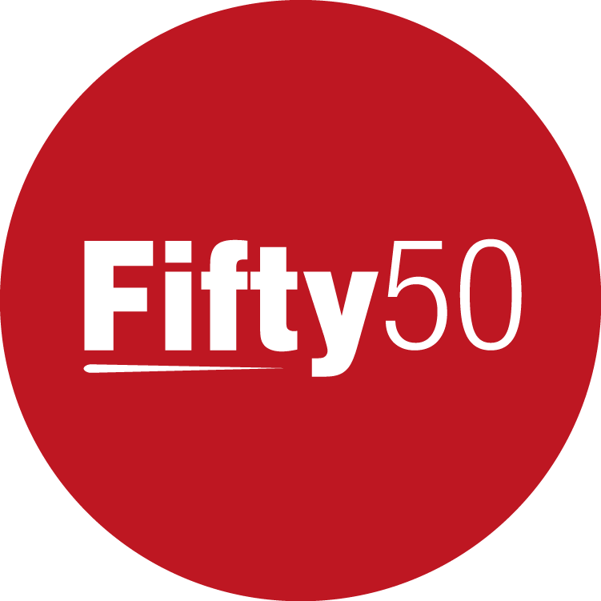

# ONLINE MENTORING PROGRAM PLATFORM

## CLIENT - ANU FIFTY50

Our client ANU Fifty50 is a student-run organisation promoting gender equity in STEM. Their vision is to have an equitable STEM pipeline from university to industry and academia, inclusive of all students, regardless of their gender.

The project is to build an Online Mentoring Platform in the form of a website. The intent is to replace the current Wattle platform used by Fifty50. The platform automates the current mentoring program. Younger students (mentees) are paired with older students (mentors), which leads to the formation of inter-year networks. The program is different from other mentoring programs around as it has targeted content and forces the users to be reflective. Users can signup to the platform anytime. Once there is a match, a mentoring relationship is started. Content is released fortnightly and mentees and mentors can meet each other either in person or online.

## TEAM
1. **Allissa Li** - *ANU Fifty50 Representative - Client*
2. **Elena Williams** - *Tutor*
3. **Nikita Bhatia** - *Team Communicator*
4. **Tyrus Caldeira** - *Project Manager*
5. **Nikhil Kumar** - *Technical Lead*
6. **Robert Whittaker** - *Project Lead*
7. **Yaya Lu** - *UX Lead*
8. **Ho Or (Alvis)** - *UX Assistant*
9. **Adrian Sweatman** - *Former Team Member*
10. **Emily Campbell** - *Former Client*

## HOW TO RUN THE PROJECT
Change directory to project and follow the instructions:
https://github.com/Nikita1710/Fifty50-Mentoring-Staging/blob/master/project/README.md

## PROJECT AUDIT REQUIREMENTS
### VALUE DELIVERED TO OUR CLIENT SINCE THE LAST PROJECT AUDIT
1. Since the last project audit, we have been able to deploy our website so it is ready as soon as we are able to train our Client into how the website works and how to use it. This means they can take control, start a test Mentoring Program in which they can have a few mentees, mentors and admins to control the site within their committee and give us any feedback using our GitHub Issues page. If you would like to view our current deployed site, this is the link : http://u5949399.pythonanywhere.com
2. We have fixed some pairing issues in which it didn't show admins who is paired with who, and if they are a mentor or not. This makes it much easier for admins to see now as they can find out exactly who is paired with who and if they are a mentor or mentee. 
3. During week 4 we held a user testing session in which we got useful feedback from the users of our website. This feedback showed us how our users actually use our site and if they use it the way we intended for them to use it. Logs of the different issues we found were taken down and added to our GitHub issues page. Our team has been working on fixing these issues over time. Documents regarding our user testing can be found at this link : <a href="https://drive.google.com/drive/folders/0Bw7MUyh12MoYRno4VWNxVEtOaXc?usp=sharing">User Testing Documents</a>
4. Within the last few weeks, we have been able to complete the tasks as part of our Minimal Viable Product. This gives our Client the ability to run the mentoring program exactly the way they used to with some small added differences with it being online, such as viewable PDF's and videos and easily finding mentor and mentee details. An outline of what was included in our MVP can be found at think link : <a href="https://drive.google.com/file/d/0B1esrEn1yXSeUk0wQW5URUY3b0k/view?usp=sharing">Minimal Viable Product</a>

### EFFECTIVE AND APPROPRIATE DECISION MAKING
Our last project audit gave insight into how we log the decisions we make. We have now created a Decision Paper document in which it encompasses all the decisions we have made since Week 1 of Semester 2. This decision paper helps us keep a track of all the important decisions we have made such as choosing to open source our project and delivering the minimal viable product to our client. A link to this document can be found here : <a href="https://docs.google.com/document/d/1XtujnVUvyAoELIFgfqHR2vYqOldP2CBT82ymI5FR2tA/edit?usp=sharing">Decision Paper</a>

## DOCUMENTATION / TECHNICAL ARTEFACTS
### GITHUB REPOSITORY 
Our source code is stored at: 
https://github.com/Nikita1710/ANUFifty50-Online-Mentoring-Platform

### TRELLO PAGE
Our Trello page is at: 
https://trello.com/techlauncher2017onlinementoringplatform

### GOOGLE DRIVE
1. Root Folder: https://drive.google.com/drive/folders/0B90o2KWKXkDqbWQ3clltaFdBVHc?usp=sharing
2. Tutor Meetings: https://drive.google.com/drive/folders/0B90o2KWKXkDqbGk5eEI1eVJXMUk?usp=sharing
3. Client Meetings:
https://drive.google.com/drive/folders/0B90o2KWKXkDqVFU4Q012NGtQVW8?usp=sharing
4. Team Meetings:
https://drive.google.com/drive/folders/0B541nY2e_DZodlpEWnY5Tzh1M0E?usp=sharing
5. Project Documents: https://drive.google.com/drive/folders/0Bw7MUyh12MoYSmVybWtVOS1GU2s?usp=sharing
6. User Testing Documents : https://drive.google.com/drive/folders/0Bw7MUyh12MoYRno4VWNxVEtOaXc?usp=sharing
7. Lecture Notes : https://drive.google.com/drive/folders/0B90o2KWKXkDqSFNJSzJUOWt4RVU?usp=sharing
8. Decision Paper : https://docs.google.com/document/d/1XtujnVUvyAoELIFgfqHR2vYqOldP2CBT82ymI5FR2tA/edit?usp=sharing

## PROJECT GOVERNANCE
### EVIDENCE OF DECISION MAKING
Evidence of all decisions since week 1 can be found in our <a href="https://docs.google.com/document/d/1XtujnVUvyAoELIFgfqHR2vYqOldP2CBT82ymI5FR2tA/edit?usp=sharing">Decision Paper</a>
### ORGANISATION OF THE PROJECT
As you can see at the top of our page, each team member has a specific role. Each role is either relevant to working on the front-end of our website or the back-end of our website. Each person has assigned tasks which can be found in our <a href="https://github.com/Nikita1710/ANUFifty50-Online-Mentoring-Platform/issues">GitHub Issues Log</a>. In addition tasks which are deemed "administrative" are logged on our <a href="https://trello.com/b/l25xR0T2/timeline-semester-2">Trello Board</a> to keep track week by week. This means all assessment related items and goals for the week are logged on that board.
### TRACEABILITY OF ACTIONS
Each task has traceability of who is working on what and who worked on what. This can be found in our <a href="https://github.com/Nikita1710/ANUFifty50-Online-Mentoring-Platform/issues">GitHub Issues Log</a>. In addition, we are making our git commits more accurate which means a task will show when it was completed by referencing it by #Number when writing our commit message.  

## PROJECT OUTPUTS
### TECHNICAL DEPTH OF OUTPUTS
Since we have made our project open source, it has been very good seeing the amount of people who have been interesed in working on our project, so far 3 have joined. As soon as they joined we needed to explain to them what the project was and what they can work on. This took a while to do as we weren't sure of their technical ability and/or what our team was working on currently. The way we solved this was to give them set tasks which our team wasn't currently working on during the week in which they could work on. The other challenge was that we were dealing with people from half way around the world which made it a bit more strenouous to communicate with. In addition to this, they posted on Slack very often which made it very important to respond to their question asap, so that they could continue their work/progress.

A few times in the past week we have found that the master branch was not working due to migration files being edited. We have found this issue due to Git because when merging files it shows the difference of two files and has some weird text it inputs into some files which "break" our project. These issues are easy to solve but can be frustrating at stages.
  
### TECHNICAL BREADTH OF OUTPUTS
Since our previous Project Concept Audit, we have been trying to complete a wide range of issues which are both located on the front-end and the back-end of our website. Such issues can include editing the size of text or the colour of text to a webpage or creating a new layout for a webpage. Many of the issues regarding the back-end are all to do with Django and updating the way in which the framework works, so that we can get it to work in the way we want. For example, manual pairing is now finished due to admins being able to see which student is paired to which mentor. In addition to this, converting our current SQLite database to a MySQL database was a different task that we had to deal with.

### APPROPRIATENESS OF OUTPUTS
All of these outputs in which we worked towards and delivered in the past few weeks contributed to completing the <a href="https://drive.google.com/file/d/0B1esrEn1yXSeUk0wQW5URUY3b0k/view?usp=sharing">Minimal Viable Product</a> in which our Client can now run a test Mentoring Program within their committee. This has ticked off one of the project requirements stated by the client.

## PROJECT APPROACH
### DEVELOPMENT APPROACH
The development approach we are taking is more or less BAU (Business as usual). In our team meetings we will get together and work on issues logged in our GitHub Issues. We will also discuss any problems we are having and might also bring these to our tutor. During the week, we will work on our Issues separately and come back to the team meeting at the end of the week with what we have done. Since opening our project to the public we now have a bit more time on our plate which allows us to offer them tasks in which they can work on and they can learn from what they have done. During each team meeting we will now review all pull requests before we move on, so that we can then update our contributors.
### ENGAGING WITH STAKEHOLDERS
Since our last Project Concept Audit, we have met up with our client twice, on the 13th of August and 27th of August, in which the agenda of the meetings can be <a href="https://drive.google.com/drive/folders/0B1esrEn1yXSebUE1RmJqVEFLWjQ?usp=sharing">found here</a>. In addition to this, we also have a channel on our Slack Team called #client_communication which can show all the discussions we have had with our client. Last client meeting, we talked to our client and discuss what are plans for the next few weeks are and outlined goals for the rest of the semester which can be found at this link: https://drive.google.com/open?id=0B1esrEn1yXSeSF93ODJOV2I3bTA . 
### PROFESSIONAL TEAM ATTITUTDE
Our team is very professional in which we keep our client up-to-date each week and also try to keep in contact with our contributors so they aren't waiting long periods of time for responses. We are very happy with what we have completed so far and keen to see our project completed at the end of the semester. All team members arrive to meetings on time unless they advise that they will be late or unable to come. In addition to this, we hold a doodle poll at the end of each team or client meeting to find a time for another one in the next week in which everyone completes straight away.
### TEAM COLLABORATION
Our team is constant talking over Slack or at our team meetings. A link to our team meetings can be found here : https://drive.google.com/drive/folders/0Bw7MUyh12MoYUS0tano1VFVlWXM?usp=sharing. In additon to this, everyone tries to complete the issues logged on GitHub and has a good track of committing on GitHub. 
### ACTING ON FEEDBACK
Since our last Project Concept Audit we found a range of actionable feedback in which we needed to address. This has been addressed and the link to the document can be found here: https://docs.google.com/document/d/1l-4OOE_cS2KFPimexC3roSAet736Pw3190H4jZOcny0/edit?usp=sharing.

## TOOLS USED
1. Github for source code and version control.
2. Slack for team and client communication.
3. Google Drive for file management.
4. Trello for project management and organisation.
5. Python and Django for backend development.
6. HTML, CSS and JavaScript for frontend development.

## CONTACT
If you don't have access to any of the above links, please contact
Nikita (u5830260@anu.edu.au) or Tyrus (u5800279@anu.edu.au) for access!
